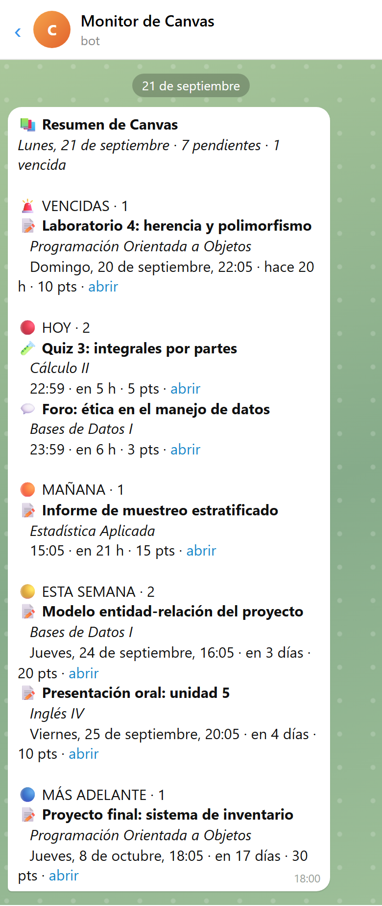
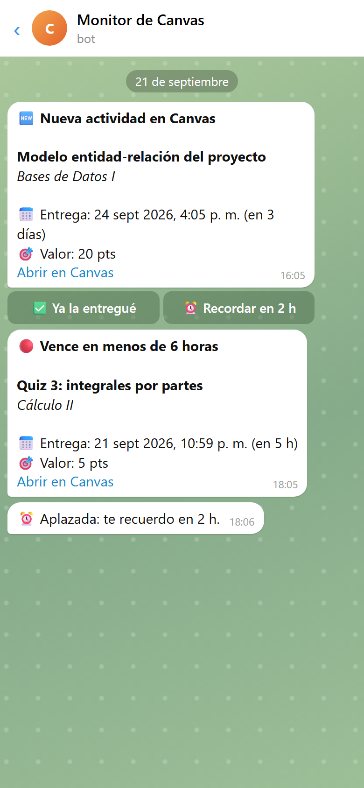
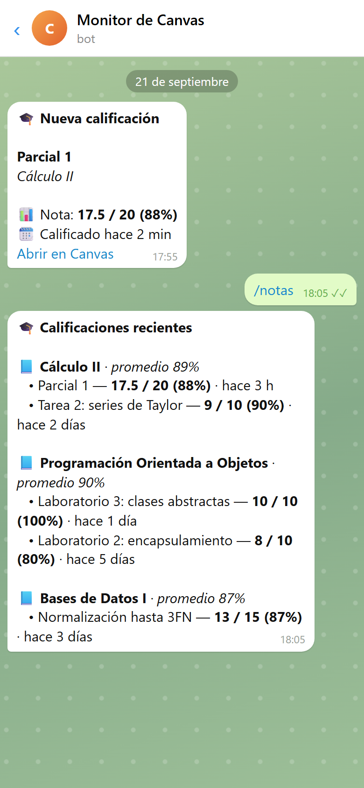
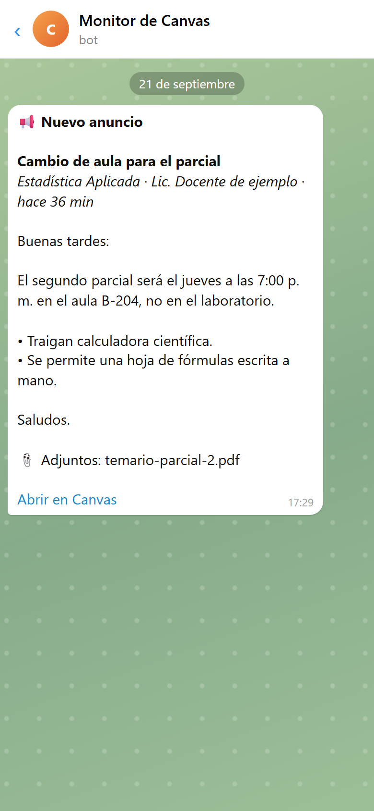
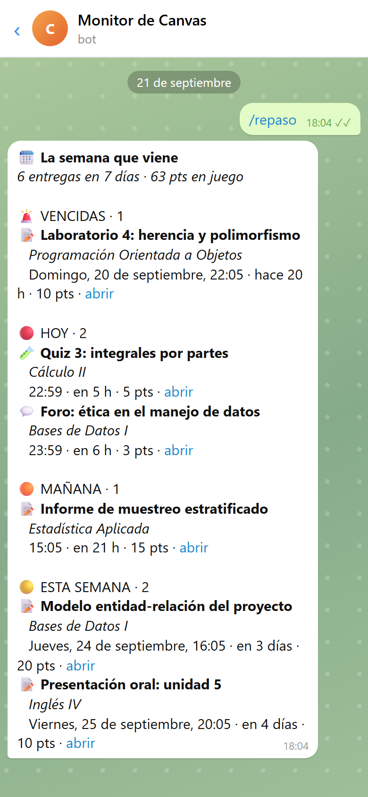
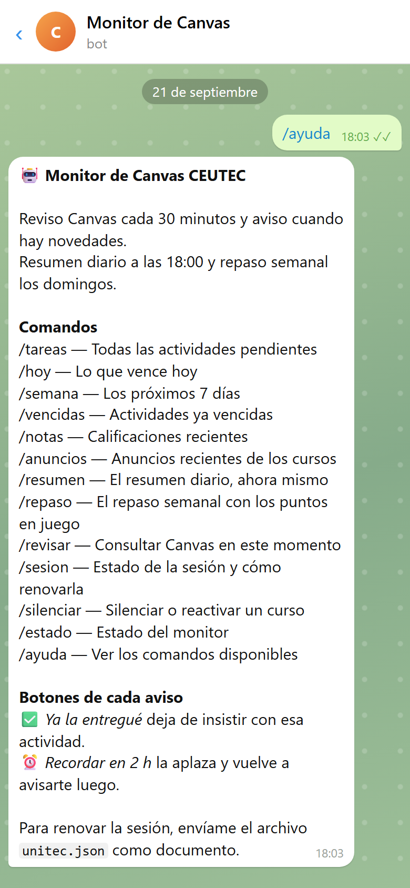

<div align="center">

# Canvas Cron

### Las tareas de Canvas te llegan por Telegram antes de que venzan

[](LICENSE)
[](https://nodejs.org/)
[](https://playwright.dev/)
[](https://core.telegram.org/bots)

Un servicio que revisa Canvas cada 30 minutos con tu sesión y te escribe por
Telegram cuando aparece una tarea, cambia una fecha, se acerca un vencimiento,
publican una nota o un docente deja un anuncio. Corre en un contenedor sin abrir
un navegador, salvo cuando la sesión necesita renovarse.



</div>

## Por qué

Canvas avisa por correo, mezclado con todo lo demás, y su calendario no dice qué
urge más. Lo que se pierde no es la tarea lejana: es el quiz que cierra esta
noche y que nadie recordó abrir.

Canvas Cron ordena las entregas por urgencia —vencidas, hoy, mañana, esta semana,
más adelante— y las manda al único lugar que se mira siempre: el chat. Cada aviso
trae dos botones para decir «ya la entregué» o «recuérdamelo en 2 horas», así que
deja de insistir cuando ya no hace falta.

## Qué hace

| | |
| --- | --- |
| **Actividades** | Aviso cuando aparece una tarea, quiz o foro nuevo, y cuando le cambian la fecha |
| **Recordatorios** | A las 72, 24, 6, 3 y 1 hora de vencer; los de 6 h o menos van en rojo |
| **Vencidas** | Aviso si una actividad pasa de fecha sin entregarse, y si ya cerró |
| **Calificaciones** | Aviso de cada nota nueva o cambiada, con el porcentaje |
| **Anuncios** | El anuncio completo del docente, pasado de HTML a texto, con sus adjuntos |
| **Resumen diario** | A las 18:00, todo lo pendiente agrupado por urgencia |
| **Repaso semanal** | Los domingos, los próximos 7 días y los puntos en juego |
| **Botones** | «Ya la entregué» y «Recordar en 2 h» en cada aviso |
| **Comandos** | `/tareas`, `/hoy`, `/notas`, `/revisar` y otros diez, respondidos al instante |
| **Horas de silencio** | De 23:00 a 6:00 sólo pasa lo urgente; lo demás espera a la mañana |
| **Latido** | Si las revisiones dejan de ocurrir, el bot lo dice |
| **Sesión** | Se renueva sola con Chromium headless, o enviándole el archivo por Telegram |

## Cómo se ve

### Avisos

<table>
<tr>
<td width="33%"></td>
<td width="33%"></td>
<td width="33%"></td>
</tr>
<tr>
<td><b>Actividades</b> — nueva, por vencer y aplazada</td>
<td><b>Calificaciones</b> — el aviso y <code>/notas</code></td>
<td><b>Anuncios</b> — completos y con adjuntos</td>
</tr>
</table>

### Consultas

<table>
<tr>
<td width="33%"></td>
<td width="33%"></td>
<td width="33%"></td>
</tr>
<tr>
<td><b>Resumen diario</b> — agrupado por urgencia</td>
<td><b>Repaso semanal</b> — con los puntos en juego</td>
<td><b>Comandos</b> — la ayuda del bot</td>
</tr>
</table>

> Los mensajes de las capturas los generan los formateadores reales del bot
> (`src/notifications.js`) a partir de **cursos y tareas inventados**, dentro de
> una maqueta de chat de Telegram.

## Cómo funciona

```text
cron (cada 30 min) ── npm run check ──> Canvas API ──> SQLite ──> Telegram
                                           ▲                        │
            sesión guardada (storageState) ┘                        │
                                                                    ▼
health-server.js ── /health · long polling de comandos · latido ── tú
```

- **La revisión no abre navegador.** Usa la API REST de Canvas con las cookies
  de una sesión guardada. Chromium sólo arranca, headless, para renovarla.
- **Cada aviso se registra después de que Telegram lo acepta.** Si la tarea
  programada se repite o se cae a la mitad, el mismo aviso no sale dos veces;
  los pendientes esperan en una bandeja de salida.
- **La primera pasada no avisa.** Registra lo que ya existía, para no mandar un
  semestre entero de notas viejas el primer día.
- **Un curso sin acceso no detiene a los demás.** Si Canvas responde 401, 403 o
  404 para un curso, se salta y se informa en `/revisar` y `/estado`.
- **Revisiones sin solaparse.** `/revisar` y la tarea programada comparten un
  archivo de bloqueo con latido.

## Tecnologías

| Área | Tecnología |
| --- | --- |
| Servicio | Node.js, sin framework |
| Navegador | Playwright (Chromium headless), sólo para renovar la sesión |
| Datos | SQLite con better-sqlite3 |
| Mensajería | API de bots de Telegram, HTML y long polling |
| Pruebas | `node:test`, 66 pruebas |
| Despliegue | Docker Compose en Dokploy, con tarea programada |

## Puesta en marcha

Requisitos: **Node 20+** y un bot de Telegram creado con
[@BotFather](https://t.me/BotFather).

```bash
git clone https://github.com/esdrasclth/canvas-cron.git
cd canvas-cron
npm install
npx playwright install chromium
cp .env.example .env
```

```bash
npm run portal           # abre el portal: inicia sesión a mano una vez
npm run telegram:setup   # valida el token y encuentra tu chat_id tras enviar /start
npm run check            # una revisión completa
npm run service          # /health, comandos de Telegram y latido
```

Mientras falten `TELEGRAM_BOT_TOKEN` o `TELEGRAM_CHAT_ID`, `npm run check`
trabaja en modo de prueba: los mensajes se imprimen en la terminal y no se
envían.

> **Hecho para UNITEC.** El portal y la instancia de Canvas
> (`unitechonduras.instructure.com`) están en `src/config.js`,
> `src/session.js` y `scripts/portal.js`. Para otra universidad hay que cambiar
> esas URLs y, si el inicio de sesión no es con Microsoft, el flujo de
> `src/session.js`. Todo lo que habla con la API de Canvas es genérico.

## Scripts

| Script | Qué hace |
| --- | --- |
| `npm run portal` | Abre el portal para iniciar sesión a mano y guarda la sesión |
| `npm run tasks` | Extrae las tareas pendientes a `artifacts/pending-tasks.md` y `.json` |
| `npm run check` | Una revisión: consulta Canvas, aplica las reglas y envía los avisos |
| `npm run service` | Servidor de salud, comandos de Telegram y latido |
| `npm run auth:export` | Exporta la sesión en base64 para cargarla en el servidor |
| `npm run telegram:setup` | Valida el token del bot y encuentra el `chat_id` |
| `npm test` | Pruebas |

## Variables

`.env.example` las lista todas con su valor por defecto. Las que hay que llenar:

| Variable | Uso |
| --- | --- |
| `TELEGRAM_BOT_TOKEN` | Token de BotFather |
| `TELEGRAM_CHAT_ID` | El único chat que recibe avisos y al que se le atienden comandos |
| `TELEGRAM_DRY_RUN` | `false` habilita el envío real |
| `UNITEC_EMAIL` · `UNITEC_PASSWORD` | Sólo para renovar una sesión vencida en headless |
| `AUTH_STATE_B64` | Sesión inicial exportada; se borra tras el primer arranque |

<details>
<summary>Las demás, con sus valores por defecto</summary>

| Variable | Uso |
| --- | --- |
| `REMINDER_HOURS` | Umbrales de recordatorio, `72,24,6,3,1` |
| `DAILY_DIGEST_HOUR` | Hora del resumen diario, `18` |
| `WEEKLY_DIGEST_DAY` · `WEEKLY_DIGEST_HOUR` | Repaso semanal, `0` (domingo) a las `19` |
| `QUIET_HOURS` | Ventana sin avisos no urgentes, `23-6`; vacía la desactiva |
| `HEARTBEAT_MINUTES` | Minutos sin revisión antes de avisar, `90` |
| `SESSION_WARN_DAYS` | Antelación del aviso de caducidad de la sesión, `5` |
| `TRACK_GRADES` · `TRACK_ANNOUNCEMENTS` | `false` desactiva notas o anuncios |
| `ANNOUNCEMENT_LOOKBACK_DAYS` | Días hacia atrás de anuncios, `14` |
| `TELEGRAM_COMMANDS` | `false` desactiva los comandos |
| `TELEGRAM_POLL_TIMEOUT` · `TELEGRAM_MAX_RETRIES` | Long polling `50` s y reintentos `3` ante 429/5xx |
| `CANVAS_REQUEST_TIMEOUT_MS` · `CANVAS_MAX_RETRIES` | `30000` ms y `2` reintentos por petición |
| `CANVAS_MAX_PAGES` · `CANVAS_CONCURRENCY` | `30` páginas como máximo y `5` consultas a la vez |
| `SQLITE_BUSY_TIMEOUT_MS` | Espera ante escrituras concurrentes, `5000` |
| `CHECK_LOCK_STALE_MINUTES` | Antigüedad para recuperar un bloqueo huérfano, `20` |
| `TIMEZONE` | `America/Tegucigalpa` |

</details>

## Despliegue en Dokploy

1. Crea un servicio **Docker Compose** con proveedor **GitHub**, este
   repositorio, rama `main` y `docker-compose.yml`. (La subida de un ZIP
   devuelve `500` y no es fiable.)
2. Copia las variables de `.env.example` en **Environment**.
3. En tu computadora, `npm run auth:export` y pega el contenido de
   `artifacts/unitec-auth.b64` en `AUTH_STATE_B64`.
4. Despliega. El volumen `unitec-bot-data` conserva la sesión y SQLite.
5. En **Schedules**, crea un trabajo **Compose**: servicio `unitec-bot`,
   comando `npm run check`, cron `*/30 * * * *`, zona `America/Tegucigalpa`.
6. Ejecútalo a mano con `TELEGRAM_DRY_RUN=true` y revisa los logs.
7. Cambia a `TELEGRAM_DRY_RUN=false`.
8. Borra `AUTH_STATE_B64` cuando exista `/app/data/auth/unitec.json`.

No hace falta publicar un dominio: el servidor de salud escucha en el 3000
dentro del contenedor y la tarea programada entra con `docker exec`.

### Diagnóstico

**`Container not found` en el schedule.** No hay contenedor en ejecución,
casi siempre porque el proceso principal murió y quedó en bucle de reinicio.
El servidor de salud ya no se cae si falla la sesión: se queda en pie y
reporta el motivo, para que el `docker exec` siempre tenga destino.

**Estado desde dentro del contenedor:**

```sh
node -e "require('node:http').get('http://127.0.0.1:3000/health',r=>{r.pipe(process.stdout)})"
```

| Respuesta | Significa |
| --- | --- |
| `ready` | Sesión y SQLite válidos; la última revisión está al día |
| `degraded` | La última revisión correcta superó `HEARTBEAT_MINUTES` |
| `invalid_session` | El archivo existe, pero no es un `storageState` válido |
| `authentication_required` | Falta la sesión; `error` dice si `AUTH_STATE_B64` es inválido |

**`AUTH_STATE_B64` inválido.** El editor de variables puede partir o recortar el
base64. Los saltos de línea se limpian solos; un valor truncado se rechaza con un
mensaje explícito. Genéralo de nuevo y pégalo completo.

## Comandos en Telegram

| Comando | Qué devuelve |
| --- | --- |
| `/tareas` · `/hoy` · `/semana` · `/vencidas` | Pendientes, agrupadas por urgencia |
| `/notas` | Calificaciones recientes por curso, con promedio |
| `/anuncios` | Los últimos anuncios, con un extracto |
| `/resumen` · `/repaso` | El resumen diario o el semanal, en el momento |
| `/revisar` | Consulta Canvas en vivo y dice qué hubo de nuevo |
| `/sesion` | Cuánto le queda a la sesión y cómo renovarla |
| `/silenciar <curso>` · `/activar <curso>` | Deja de avisar de un curso, o vuelve a hacerlo |
| `/estado` | Sesión, última revisión, conteos y configuración |
| `/ayuda` | La lista de comandos |

Las consultas responden con lo guardado en SQLite, así que son inmediatas;
`/revisar` es el único que sale a Canvas. Sólo se atiende el chat de
`TELEGRAM_CHAT_ID`: los mensajes de cualquier otro se registran y se descartan.

## Sesión

**Renovación automática.** Con `UNITEC_EMAIL` y `UNITEC_PASSWORD`, el monitor
intenta renovar la sesión con Chromium headless. Si Microsoft pide MFA, CAPTCHA
o una confirmación, avisa por Telegram y hace falta una sesión nueva: el
proceso **no intenta evadir esos controles**.

**Renovación desde Telegram.** Ejecuta `npm run portal`, inicia sesión y envía
`playwright/.auth/unitec.json` al bot **como documento**. El bot lo prueba
contra Canvas antes de instalarlo; si Canvas lo rechaza, la sesión activa queda
intacta.

El bot avisa solo cuando la sesión está a menos de `SESSION_WARN_DAYS` de
caducar.

## Datos

En desarrollo se usa `./data`; en Docker, el volumen montado en `/app/data`:

```text
auth/unitec.json     sesión de Canvas
chrome-profile/      perfil para renovar la sesión
notifications.db     tareas, notas, anuncios y avisos enviados
output/              último resultado de la extracción
```

La carpeta está excluida de Git. **Su contenido es una credencial**: con él
se entra a tu cuenta de Canvas.

## Estructura

```text
src/
  canvas.js          cliente de la API de Canvas, con reintentos y paginación
  checker.js         una revisión completa
  notifications.js   reglas de aviso y formato de cada mensaje
  bot.js             comandos, botones y latido
  telegram.js        envío, división de mensajes largos y reintentos
  database.js        SQLite
  session.js         renovación headless de la sesión
scripts/             puntos de entrada de cada npm run
test/                pruebas con node:test
docs/capturas/       imágenes de este README
```

## Contribuir

[`CONTRIBUTING.md`](CONTRIBUTING.md) explica cómo probar sin enviar mensajes,
qué no romper y qué comprobar antes de un pull request.

## Licencia

**[MIT](LICENSE)**. Úsalo, modifícalo y distribúyelo como quieras.
